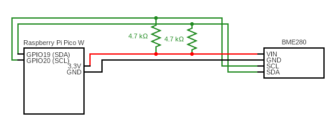

## About the project
A complete driver for the BME280 based on the PICO W with I2C communication. By changing the communcation protocol you are able to use this on any device.

## Pre-requisites

### 1. Raspberry Pi Pico W SDK
This is needed for all includes regarding the I2C. You can find a guide on how to install it here:

[https://datasheets.raspberrypi.com/pico/getting-started-with-pico.pdf](<https://datasheets.raspberrypi.com/pico/getting-started-with-pico.pdf>)

### 2. GCC
Compiler for C code.

**For windows**  
[Guide for windows](https://medium.com/@anazilthottunghal/a-guide-to-installing-gcc-on-windows-5cc95c2f38c4)

**For Mac**  
`brew install gcc`

**For Linux**  
`sudo apt-get install gcc`

### 3. Cmake
This is our build tool for the project and routinely used for raspberry pi pico projects.

[You can download it here](https://cmake.org/download/)

### 4. Correctly connected system
This is an example of how connected mine:




http://lafftale1999.github.io/bme280_driver

## Include in your project
If you want to include this driver in your project, you can follow these steps.

### 1. Add submodule to your git repo
Do this command to add it as a submodule to your project:

`git submodule add git@github.com:lafftale1999/bme280_driver.git lib/bme280`

### 2. Add functionality to your root CMakeLists.txt
Add the following to your root CMakeLists.txt:

`add_subdirectory(lib/bme280)`  
`target_link_libraries(your-project-name bme280)`  
`target_include_directories(your-project-name PRIVATE ${CMAKE_CURRENT_LIST_DIR}/lib/bme280)`

## Configurations
In the headerfile of bme280.h you can configure the drivers communication.

**bme280.h**
```c
#define BME280_UNITS_ON_BUS          1       /**< Number of BME280 units connected */
#define BME280_ADDRESSES_ON_BUS      {0x76}  /**< I2C addresses of connected BME280 units */
#define BME280_ADDRESS_LENGTH        7       /**< BME280 I2C address length (7-bit) */
```

**bme280_i2c.h**
```c
#define I2C_SDA_PIN                 14              /**< SDA pin */
#define I2C_SCL_PIN                 15              /**< SCL pin */
#define I2C_PORT                    i2c1            /**< Which internal i2c module is used. Often i2c0 or i2c1 */
#define I2C_FREQUENCY               100000          /**< Frequency for communication */
```

## Build
To build you can use the following commands from the root directory of your project.

1. `mkdir build`
2. `cmake -B build -G Ninja -S .`
3. `cmake --build build`

**Note:** The driver can not be build on it's own. It depends on a proper CMakeLists.txt for the include paths to the SDK which provides the I2C driver.

## Author
This has been one of my summer projects which has been supervised at WSI Sigma Connectivity during my internship. I'm currently studying to become an embedded engineer.

If you have any questions regarding the driver, don't hesitate to ask!